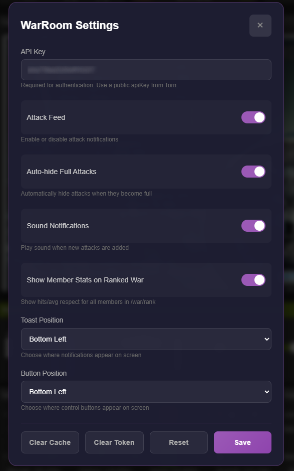

# RR - Torn War Helper

A userscript that enhances the Torn City war experience by providing real-time attack notifications and comprehensive ranked war statistics.

## Features

### 🎯 Real-Time Attack Coordination
- **Live Attack Feed**: Receive instant notifications when faction members create coordinated attacks
- **Smart Notifications**: Toast-style alerts with countdown timers showing time remaining
- **Quick Actions**: Join attacks, mark as done, or launch attacks directly from notifications
- **Auto-Hide**: Automatically hide full attacks to keep your feed clean
- **Participant Tracking**: See who's joining each attack in real-time

### 📊 Enhanced Ranked War Statistics
- **Live Stats Display**: View current war limits and requirements directly on the ranked war page
- **Member Performance**: See individual member stats including hits and average respect
- **Compliance Tracking**: Visual indicators showing who meets/exceeds war requirements
- **Auto-Refresh**: Configurable automatic data refresh to keep stats current
- **Personal Stats**: Quick view of your own performance in the current war

### ⚙️ Highly Configurable
- **Flexible Positioning**: Place notifications and controls anywhere on screen
  - Bottom Left/Right
  - Top Left/Right
- **Sound Notifications**: Optional audio alerts for new attacks (desktop only)
- **Toggle Features**: Enable/disable individual features as needed
- **Persistent Settings**: Your preferences are saved automatically

## Installation

### Prerequisites
1. **Tampermonkey** browser extension
   - [Chrome](https://chrome.google.com/webstore/detail/tampermonkey/dhdgffkkebhmkfjojejmpbldmpobfkfo)
   - [Firefox](https://addons.mozilla.org/en-US/firefox/addon/tampermonkey/)
   - [Edge](https://microsoftedge.microsoft.com/addons/detail/tampermonkey/iikmkjmpaadaobahmlepeloendndfphd)
   - [Safari](https://apps.apple.com/us/app/tampermonkey/id1482490089)

2. **Torn API Key** (public level is sufficient)
   - Get yours at: https://www.torn.com/preferences.php#tab=api

### Install Script
1. Click here to install: [Install RR - Torn War Helper](https://github.com/TuRz4m/warroom-userscript/raw/refs/heads/main/warroom.user.js)
2. Tampermonkey will open showing the script
3. Click **Install**
4. Navigate to any Torn page
5. Click the ⚙️ settings button that appears
6. Enter your Torn API key
7. Configure your preferences
8. Click **Save**

## Usage

### Attack Notifications

The script will automatically show notifications when:
- A faction member creates a coordinated attack
- An attack is updated (someone joins)
- An attack becomes full

Each notification shows:
- Target name and ID
- Time remaining (with urgent warning when < 1 minute)
- Number of participants (filled/total)
- List of participants
- Action buttons:
  - **Join**: Join the attack
  - **Attack**: Launch the attack (only if you've joined)
  - **Done**: Mark the attack as complete

### Creating Coordinated Attacks

When viewing a target's profile:
1. A "Coordinated Attack" button appears below the attack section
2. Click it to open the dialog
3. Set:
   - Number of people needed (2-30)
   - Expiration time (1-15 minutes)
   - Wait until full option
4. Click **Create**
5. The attack is shared with all faction members using WarRoom

### Ranked War Stats

When on the ranked war page (`/factions.php?step=your#/war/rank`):
- Current war limits display automatically at the top
- Each member row shows:
  - Number of hits (color-coded for compliance)
  - Average respect (color-coded for compliance)
- Your personal stats are highlighted
- Click the refresh button to manually update stats
- Toggle auto-refresh with the button icon

### Settings

Access settings via the ⚙️ button. Available options:

**General**
- **API Key**: Your Torn API key (required, desktop only)
- **Attack Feed**: Enable/disable attack notifications
- **Auto-hide Full Attacks**: Automatically hide completed attacks

**Notifications**
- **Sound Notifications**: Play sound for new attacks (desktop only)
- **Toast Position**: Where notifications appear (4 corners)

**Ranked War**
- **Show Member Stats**: Display performance stats on ranked war page

**Interface**
- **Button Position**: Where control buttons appear (4 corners)

**Maintenance**
- **Clear Cache**: Remove cached target data
- **Clear Token**: Force re-authentication
- **Reset**: Restore default settings

## Controls

### Main Buttons

| Button | Function | Default Position |
|--------|----------|------------------|
| 🔔 | Toggle attack feed on/off | Bottom-left |
| ⚙️ | Open settings | Bottom-left + 46px |

Button states:
- **🔔 Purple**: Feed enabled and connected
- **🔔 Red with X**: Feed disabled
- **🔔 Yellow pulsing**: Connecting...

## Technical Details

### Compatibility
- **Platforms**: Desktop browsers with Tampermonkey
- **Pages**: 
  - `torn.com/loader.php` (attack profiles)
  - `torn.com/factions.php` (ranked war stats)
- **API**: Uses WarRoom service API + Torn API
- **Authentication**: JWT-based with automatic token refresh

### Performance
- Minimal impact on page load
- Efficient SignalR long-polling connection
- Smart caching for stats (1-hour TTL)
- Automatic reconnection on connection loss

### Privacy & Security
- API key stored locally in browser storage
- JWT tokens expire after defined period
- No data sent to third parties
- All communications over HTTPS

## Support & Contribution

### Issues
Found a bug? [Open an issue](https://github.com/TuRz4m/warroom-userscript/issues)

### Updates
The script auto-updates through Tampermonkey. Manual updates available at:
- **Update URL**: https://github.com/TuRz4m/warroom-userscript/raw/refs/heads/main/warroom.user.js

### Development
Built with:
- Vanilla JavaScript (ES6+)
- SignalR (long-polling for real-time)
- Tampermonkey GM API
- Modern CSS with animations

## Credits

**Author**: TuRzAm  
**Version**: 1.2.0  
**License**: See LICENSE file  
**Website**: https://torn.zzcraft.net/

---

*This script enhances your Torn City experience. Always follow Torn's rules and terms of service.*
